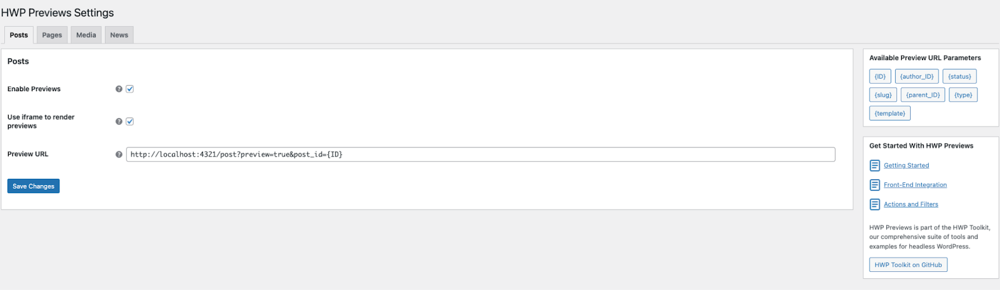
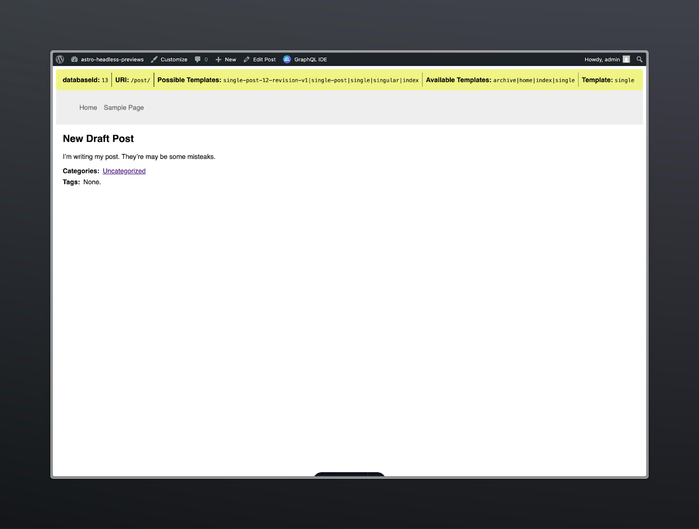

Historically, previews for headless WordPress have been quite complicated. [Gatsby](https://www.gatsbyjs.com/plugins/gatsby-source-wordpress/) and [Faust.js](https://faustjs.org/docs/how-to/post-previews/) have both implemented their own solutions, but required specific buy-in on those solutions. To alleviate this, our headless OSS team released the [HWP Previews plugin](https://github.com/wpengine/hwptoolkit/tree/main/plugins/hwp-previews#readme) for headless WordPress that sets you up to do previews without using Faust or Gatsby. Now, you don’t have to use Faust to give your publishers the preview experience they expect in WordPress.

This plugin overrides WordPress's default preview behavior and allows you to control how previews are requested (URL, path, query params, etc.). The plugin is in beta, so we’d love to hear about any missing features or bugs.

Since the HWP Previews plugin covers our needs on the WP side, this article will cover implementing the functionality on the framework side, i.e., Astro. Join me as we dive into WPGraphQL, authentication, and previews!

## Goal

1.  We want the same components/code that renders our production pages to render previews so they’re identical.
2.  We want the WP experience to be seamless for content creators.

## Requirements

### Astro

1.  Needs to know whether a request is for a preview or production page
2.  Needs to know what content is being previewed
3.  Needs to be able to render the preview on demand
4.  Needs to use the same template/components/queries as production pages
5.  Needs to be able to authenticate the preview request

### WordPress

1.  Needs to know where our front-end is for previews(domain/path)
2.  Needs to be able to know how to request a preview for a given post/page (path/queries/headers/etc)
3.  Needs to leverage the existing “preview” links/buttons/popups provided by native previews to keep the experience seamless.

## Pesky Details

### Auth

What you’re not seeing in the URL is also the authentication that’s happening. This preview URL will redirect the user to the WordPress login if they’re not already authenticated. Unpublished posts are by default non-public. You must be authenticated and authorized to view them. This holds true in WPGraphQL; if you query an unpublished post, it’ll return null unless you authenticate your GraphQL query. We’ll need to authenticate users and make sure any GraphQL requests receive proper Authentication headers for preview routes.

### Database ID

So why doesn’t WordPress use a URL like `https://mywordpresssite.com/blog/hello-world/?preview=true`? After all, this URL is unique to the post, and the query param tells WordPress to render the draft version. If only it were that simple!

WordPress doesn’t assign a URI to a post until _after_ it has been published. This means drafts and scheduled posts don’t have a dedicated URI. They may have a slug, but this isn’t necessarily unique in WordPress land. Thus, to correctly render previews, we must handle routing and data fetching based on the databaseId, not the URI. This will come up in several ways later, but for now, know that this is a constraint of WordPress we must adapt to.

## Strategy

Like in any headless WordPress setup, we’ll need to start with working routing and data fetching. For this article, I’ll be starting from where we left off in the [Routing and GraphQL article](/blog/astro-wordpress-routing-and-graphql/) and adding on previews. This means we’ll be using URQL for data fetching and the template hierarchy for routing.

### SSR

First, we need SSR. Our original `[...uri].astro` catch-all route was static. We have two options: convert it to SSR or add a dedicated `/preview/` route that is SSR. For this example, I’ve opted to convert my catch-all route to SSR.

### Detect Preview

Next, like WordPress, we need to detect whether we need to authenticate the request and fetch preview data. The `preview=true` query parameter does this for us. We’ll use this to detect previews and handle them.

### Database ID

As we discussed before, the database ID is required by WordPress for previews. In my example, I get this by having the Previews plugin pass this as a query param: `post_id={ID}`. 

### Auth

The goal of this article is to show you previews, not implement authentication. Because of that, I’ve opted for the simplest possible authentication method, which is not secure. I’ve opted to hard-code my admin credentials in my code and use them for [Basic authentication](https://developer.mozilla.org/en-US/docs/Web/HTTP/Guides/Authentication). 

> **Note**: I can do this because the WordPress server used in this example is not public; its entire DB and front-end example are running on your computer if you start it from the [repo](https://github.com/wpengine/hwptoolkit/tree/main/examples/astro/previews). If you’re going to implement previews, you’ll need to implement proper authentication if you don’t want a security breach. I’d highly recommend the [WPGraphQL Headless Login](https://github.com/AxeWP/wp-graphql-headless-login) plugin by Dovid Levine.

## Configuring WordPress

Selecting to preview a post or page in WordPress results in a URL path that will look something like `https://mywordpresssite.com/?preview=true&p=23`, with `p` being the post's database ID.

What needs to change here? First, our front-end is not on the WordPress server; we need to tell previews to go to our JS framework. This is likely your production server, but static site builders like Gatsby may require a dedicated preview server. Others may require a dedicated path, query parameters, or headers.

Finally, WordPress renders the appropriate PHP template at this route. To keep our experience seamless, I’d rather the content creators see the headless front-end here, not get kicked out to a new tab or have to find their way back into WordPress admin.

This means we need to customize the URL that we’ll route to when clicking “preview” and customize the `?preview=true` behavior to embed an iframe of our front-end. The good news is that this is exactly what the [HWP Previews](https://github.com/wpengine/hwptoolkit/tree/main/plugins/hwp-previews#readme) plugin does! 



## Building It out

Alright, now that WordPress is configured and our basic strategy is in place, let’s start implementing this in Astro.

### Catch-all Route

Our first changes will be in the [catch-all route,](https://github.com/wpengine/hwptoolkit/blob/main/examples/astro/previews/example-app/src/pages/%5B...uri%5D.astro) where we fetch the template. We’ll start by capturing and storing our `preview` and `post_id` search params.

```javascript
const isPreview = Astro.url.searchParams.get("preview") === "true";
const postId = Astro.url.searchParams.get("post_id") || undefined;
```

We’ll also want to store this search parameter for later use. Because we’re using Astro’s rewrite functionality, this param gets stripped from the URL accessed by templates. Thus, we’ll save this for use later.

```
// Locals is an Astro pattern for sharing route data.
Astro.locals.isPreview = isPreview;
```

### Authentication

I’ve told you I did some really basic things. Are you ready for it?

```
export const authHeaders = (isPreview) => {
  return isPreview
    ? {
        Authorization: `Basic ${Buffer.from(
          `admin:password`
        ).toString("base64")}`,
      }
    : undefined;
};
```

As you can see, if `isPreview` is `true`, we add the `Authorization` header; otherwise, we don’t. This is used in combination with a great feature of the URQL GraphQL client.

```
const response = await client.query(QUERY, VARIABLES,{
    fetchOptions: {
      headers: {
        ...authHeaders(isPreview),
      },
    },
  }
);
```

On top of taking the query and variables for a query, the third parameter of URQL’s query function takes a config. This is the identical config you can pass when creating the client. That means I can create a single client with good defaults and override as needed. I don’t have to select between any number of clients. I can use a single client and add headers and other config as needed. 

### Template Hierarchy

In the last article, we built the `uriToTemplate` function for handling our template-hierarchy routing. Now that we want to implement previews, we need this to handle the database ID or URI to the template. If you happened to pay attention to the original [seed query](https://github.com/wpengine/hwptoolkit/blob/main/examples/astro/previews/example-app/src/lib/seedQuery.js#L13-L91) we were using, you would have noticed that because we copied it from Faust, the query was already set up to handle this.

```
query GetSeedNode(
    $id: ID! = 0
    $uri: String! = ""
    $asPreview: Boolean = false
  ) {
    ... on RootQuery @skip(if: $asPreview) {
      nodeByUri(uri: $uri) {
        __typename
        ...GetNode
      }
    }

    ... on RootQuery @include(if: $asPreview) {
      contentNode(id: $id, idType: DATABASE_ID, asPreview: true) {
        __typename
        ...GetNode
      }
    }
  }
```

Thus, I updated my `getSeedQuery` function to handle the additional variables. Auth was also handled [here](https://github.com/wpengine/hwptoolkit/blob/main/examples/astro/previews/example-app/src/lib/seedQuery.js#L3-L11)_._

```
export async function getSeedQuery(variables) {
  return client.query(SEED_QUERY, variables, {
    fetchOptions: {
      headers: {
        ...authHeaders(variables.asPreview),
      },
    },
  });
}
```

Finally, I updated `uriToTemplate` to `[idToTemplate](https://github.com/wpengine/hwptoolkit/blob/main/examples/astro/previews/example-app/src/lib/templateHierarchy.ts#L27-L98)`, which handles both `uri` and `databaseId`.

```
export async function idToTemplate(
  options: ToTemplateArgs
): Promise<TemplateData> {
  const id = "id" in options ? options.id : undefined;
  const uri = "uri" in options ? options.uri : undefined;
  const asPreview = "asPreview" in options ? options.asPreview : false;

  if (asPreview && !id) {
    console.error("HTTP/400 - preview requires database id");
    return returnData;
  }

  const { data, error } = await getSeedQuery({ uri, id, asPreview });

  //...
}
```

Finally, we update the call to this function from the [catch-all route](https://github.com/wpengine/hwptoolkit/blob/main/examples/astro/previews/example-app/src/pages/%5B...uri%5D.astro#L14).

```
const results = await idToTemplate({ uri, asPreview: isPreview, id: postId });
```

### Updating Templates

You’d be forgiven for thinking we’re done. Remember that pesky thing I mentioned about having to use databaseIds for preview queries? Well, we now have to update our templates to do this.

While we could make our templates use the `@skip` and `@include` pattern like the seed query…there is just no point. The seed query handled this complexity for us and returned a bunch of data that we used to select a template. That data included the database ID. We can now use that for all further queries instead of the URI!

Let’s start by grabbing those `isPreview` and `databaseId` variables so they’re handy.

```
const isPreview = Astro.locals.isPreview;
const databaseId = Astro.locals.templateData?.databaseId;
```

Like with our seed query, we will also need to add authentication when appropriate.

```
const { data, error } = await client.query(
  gql`
    #...
  `,
  {
    databaseId,
    isPreview,
  },
  {
    fetchOptions: {
      headers: {
        ...authHeaders(isPreview),
      },
    },
  }
);
```

Next, we need to update our query. [Previously](https://github.com/wpengine/hwptoolkit/blob/main/examples/astro/template-hierarchy-data-fetching-urql/example-app/src/pages/wp-templates/single.astro#L23-L48), we used `nodeByUri` for all of our queries. This works great, but it doesn’t accept database IDs or support returning preview data. Thus, for posts and pages, we need to use `contentNode`.

```
const { data, error } = await client.query(
  gql`
    query singleTemplatePageQuery(
      $databaseId: ID!
      $isPreview: Boolean = false
    ) {
      contentNode(
        id: $databaseId
        idType: DATABASE_ID
        asPreview: $isPreview
      ) {
        id
        uri
        ... on NodeWithTitle {
          title
        }
        ... on NodeWithContentEditor {
          content
        }
        ... on Post {
          categories {
            nodes {
              name
              uri
            }
          }
          tags {
            nodes {
              name
              uri
            }
          }
        }
      }
    }
  `,
  {
    databaseId,
    isPreview,
  },
  {
    fetchOptions: {
      headers: {
        ...authHeaders(isPreview),
      },
    },
  }
);
```

For this change, I didn’t have to alter any of the actual query that defines the returned data. I also updated the Astro [html template](https://github.com/wpengine/hwptoolkit/blob/main/examples/astro/template-hierarchy-data-fetching-urql/example-app/src/pages/wp-templates/single.astro) to access `data.contentNode` instead of `data.nodeByUri`.

Finally, I added a quick check to validate that I got a post back. If you’re not aware, having no or incorrect credentials for a query in GraphQL doesn’t result in an `HTTP/401` error, but a `null` value. I’ll add a check to return `HTTP/404` if the value is `null`. This handles incorrect database IDs and unauthorized queries.

```
if (!data.post) {
  console.error("HTTP/404 - Not Found in WordPress:", databaseId);
  return Astro.rewrite("/404");
}
```

## It works!

## 

Previews! We’ve implemented one of the biggest missing features of headless WordPress. HWP Previews did all the heavy lifting on the WP side, and we took what it provided to render the posts. Our content creators can now publish with confidence, knowing exactly what their work will look like on the front end!

I’m excited to have this plugin available for folks to build custom preview experiences outside of Gatsby and Faust. What are you going to build with it? Come join our [Headless WordPress Discord](https://faustjs.org/discord) and let us know!
