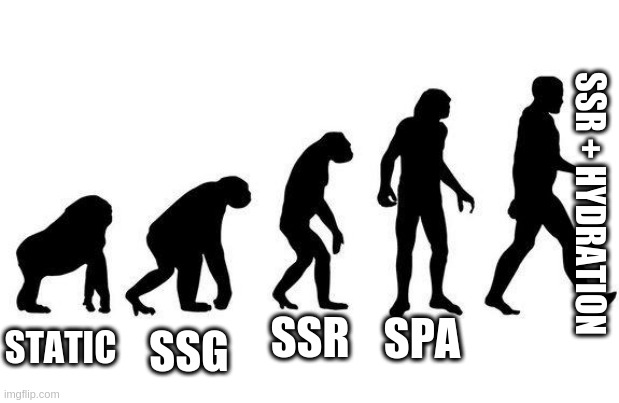

I recently saw a tweet suggesting we all these JS frameworks are a waste of time and we needed to go back to what the web was meant to be, PHP. I honestly don't know if this person was serious...and I'm not going to try and hunt down a random comment on a random thread to find out.

I get the sentiment, the good old days, where HTML and CSS were all I needed...so dreamy 🤤...(no, not even PHP 'cause if we're going back...we're going aallll the way back). But, all I was building was a glorified bookmark page I used as my new tab screen in Firefox 3. So, yeah...not likely to happen on that mid-size blog I manage for a marketing company.

I can here you now reader...

> What stack _should_ I choose? What's "the best" stack/framework/etc.?

This post, and ultimately the series, will not try to answer those questions. Because, if I was attempting to do so, I'd be giving you my opinion, and well, I would be wrong. What I am looking to provide you, dear reader, is the knowledge and mental framework needed to make an informed engineering decision _for your project_.

## The methods

We will start this week by looking at the 5 ways to build website. Yes, there are only 5...I think. also I'd like to introduce you to Dave. Dave is a Modern Web Developer™! Everyone say "Hi!" to Dave...I'm waiting...okay. Dave is going to help us in our scenarios as we discuss the 5 ways we build the web.

### Static

> A long time ago in galaxy far, far away...
>
> Developers wrote HTML in HTML documents, CSS without JS, and JS _without Babel_; and they did this all without a bundler.
>
> 🤯

These days may feel like a bygone era for those of us who didn't live them as developers in…the 90s, or \*checks watch\* yesterday.

Dave(remember Dave?) is writing an HTML page for every page of his site. Dave is writing and using CSS via an external file, in HTML `<style>` tags, or inline styles. Dave is writing JS that is compatible with all target browsers and manually included via `<script>` tags on every page. Dave is writing content into those HTML files, and if Dave decides to add, update, or delete content he needs to edit the HTML directly. No PHP. No CMS. No build step. Just pure HTML, CSS, and JS as the internet gods intended!

There was a problem with the "_everything_ is static" method. See, Dave's site has grown over time and he now has 500 blog posts. A majority of the code in each of those HTML documents is identical. Every time Dave adds a new post he has to copy and paste(or rewrite) all the same code. Occasionally Dave finds a bug and needs to make a change to each of the 500 posts, poor Dave! 😭

### Static Site Generator(SSG)

Ah yes, the next step in the evolution of web development. Dave is getting smarter...

To solve this Dave decided to use an SSG. This helped by allowing him to help template out his blog posts. Dave wrote out the structure (HTML), styles (CSS), and code(JS) once in a template file. The SSG then used that template, injected the post content, and out came his 500 blog posts! 🥳Dave is feeling like a real boss. 💪 He has cut his development time way down. Now he's reinvesting that time into fixing bugs and making his site way sweeter. 🕺 You go Dave!

As Dave's site grows he wants to be able to interact with his readers. This means his readers need to be able to login in securely and post comments. Dave configures his server to accept post requests and save them to a database. Next, he connects his SSG to the database, _et voilà_! ...or not. Dave realizes this is painfully slow. His readers comments only show up on the site after the site rebuilds. His SSG takes 5 minutes to run, even if it was running on a continuous loop, this would be a painfully long time to wait for comments to show up! 🥴

### Server Side Rendering(SSR)

Web life is hard on Dave, but he's smart and after some research, he learns about SSR.

By setting up his web server with PHP Dave's server can now build any page of his site when his readers visit. This means no waiting for 5 minutes for the entire site to rebuild, when only one page has had a comment added. Dave and his readers can now see comments being added in real time. Dave can even make some other cool widgets that customize pages for logged in users and allow them to edit their own profile. All this is possible because the server identifies the user when they log in and can deliver a custom experience to each of them. 🎉

All hail the glory of SSR! These fancy features on Dave's site make him a legend on the Interwebs. He's getting new readers and more traffic every day! Dave has a traffic problem. No, not on his morning commute (he works from home), but on his server. All these new readers mean his servers are working over time and his hosting bill is starting to look like the Dracuala of his bank account. 🧛🏛 Dave can either save his bank account and let his users suffer with long loading times or he can find a way to save on server costs. Dave is definitely missing the days of static content on a Content Delivery Network (CDN), though he doesn't miss all the work it would take to keep his now thousands of blog posts up to date!

### Single Page Application (SPA)

Lucky for Dave a new JS framework called `DontPlanAhead.js` has come out to solve this problem. It's a new way of building websites that will save him lots of money 💰💰 on hosting cost and allow him to go back to serving static content on a CDN.

SPAs mean moving all that processing Dave's servers are currently doing into JS in the browser. Dave also kinda hated PHP, so he's happy to be able to do all his work with his one true love, JavaScript. Because of Dave's new SPA he's able to deliver a great application that has all the dynamic benefits of an SSR site, without the server cost; and the benefits of serving static assets, without all the maintenance overhead. It's a win, win, win...win. 🏆👏

You guessed it, Dave has a problem, if not many. First, for once in his life is loosing readers! 😢 Turns out his SEO(Search engine Optimization) is in very dirty, dark, hole cause most search engines don't run all that JS he's sending to browsers. This means potential new readers aren't able to find his content. Second, all Dave's mobile and rural readers are dropping like flies cause his site takes 20 seconds to load by the time it downloads, parses, and renders the page.

God help Dave. 🙏

### SSR + Hydration

Lucky for Dave the makers of `DontPlanAhead.js` have realized this is an issue and integrated SSR features into the framework. But Dave is starting to get weary of all these changes. In the early days his solutions worked, but they didn't scale over time. That wasn't a big deal, it took years before his readership or blog out grew a soulution to the point where scale was an issue. When he switched to `DontPlanAhead.js` he was able to solve his scaling issue but in doing so immediately created more dramatic issues that weren't his problem alone, instead he'd made problems for his readers. 😬

These new SSR features are nice, but Dave knows scaling SSR on his shoestring budget is unrealistic. He does some more research and realizes SSR and SSG are basically the same concept, but differentiate on when, and how often, they executed. In both methods Dave has a template system to build his HTML into which his blog content is then injected. SSG happens once at "build time" when content changes. Those assets are then put on a server or CDN for delivery to his readers. SSR, is done continuously, and on demand every time a request come in from his reader's browsers and is delivered directly to that reader.

Dave continues his research with this new knowledge. He knows there are features of his site that need dynamic abilities, but he wants to serve fully rendered, static content to improve his site's performance and fix his SEO problems. This is acomplished, he learns, by changing how his SPA is built. The new configuration utilizes the SSR features so he gets a fully rendered static stite like he'd get from a a SSG; but, after that content loads it's "hydrated" back into a SPA. It requires some rework, but Dave saves himself a full rebuild. In the end his users see content within a few seconds and search engines are free to frolic through his content once again!

Dave is ecstatic, he can rebuild his site only when content changes and deliver those static assets to a CDN. On the other hand the re-hydrated SPA allows his comments sections and other dynamic features to render new and unique content as his readers browse. His site is getting new readers because of his fixed SEO and his long time readers are no longer being driven away by long loading times. Dave has brought peace to a chaotic world. ☮️

You're a legend Dave. 🖖

## "But you forgot!!!!"

Did I? Before you complain let me talk about some other terms floating around you might be wondering about. If you read the following and still think I missed something please let me know over on twitter ([@moon\_meister](https://twitter.com/moon_meister)) or send me a message at the bottom of the page 👇!

### JAMStack ([https://jamstack.org/](https://jamstack.org/))

The JAM stack is pretty sweet and many sites are using it now. While the JAM stack grew out of the advent of the SPA it can be integrated with any of the above methodologies. By the time Dave had an SPA, he had a JAMstack site, his SSR + Hydration site was most assuredly JAMstack as well. A static or SSG site could definitely be build using JAMstack methods as well. SSR is a little fuzzier. JAMstack is mostly(IMO) a method of delivering dynamic content via static files. SSR is already a way of delivering dynamic content, so adding JAMstack principles may be redundant, but not impossible or even entirely unreasonable.

### Application Shell ([App Shell](https://developers.google.com/web/fundamentals/architecture/app-shell))

The App Shell is a lesser known term but was probably a precursor to the JAMstack. The idea behind App Shell is you deliver static HTML pages that have no content but the shell of your site's layout. The content is then populated on the client side using JS. To me the line between SPA and App Shell is a matter of degree. All SPAs require a very basic HTML file (Doctype, html, head, and body tags with little to nothing else). A true App Shell site will have the layout and placeholders in that static content as well. Into that shell the SPA (the "App") is then rendered. App Shell is an SPA with a larger shell. Additionally, the initial shell could come from the Static, SSG, or even SSR methods.

The important thing to remember is that "App Shell" and "JAM stack" are additive to what you're already doing. I could have a SPA that uses neither of these things because it's a glorified SSG, or an SPA that implements App Shell and JAM stack methodologies.

## "But I don't have a blog!"

If Dave built a web based email product instead of a blog, anything requiring a rebuild when a new email(aka. content) arrived would be a non-starter. This means no static and no SSG. Dave's options would have been constrained by the needs of his project.

Please don't take what I've written here as "SSR + Hydration is best/only way", or "SSR + Hydration fixes all of the things!", or that _any_ of these methods are better or worse than another. This would be far from true and what's best for any one situation is dependent on the scale and demands of the project.

There's a lot more to say in the area of choosing a method and is exactly what we'll be covering in part 2.

## Conclusion

Thanks for reading! I set out to write about a completely different topic and in the process realized I had a lot more to say. Stay tuned for part 2 where we'll talk more specifically about how to define you project's needs and pick a method (or several).

I hope this was an insightful read. If you have questions or comments I would love to here from you on my twitter ([@moon\_meister](https://twitter.com/moon_meister)) or bellow via the contact form.
